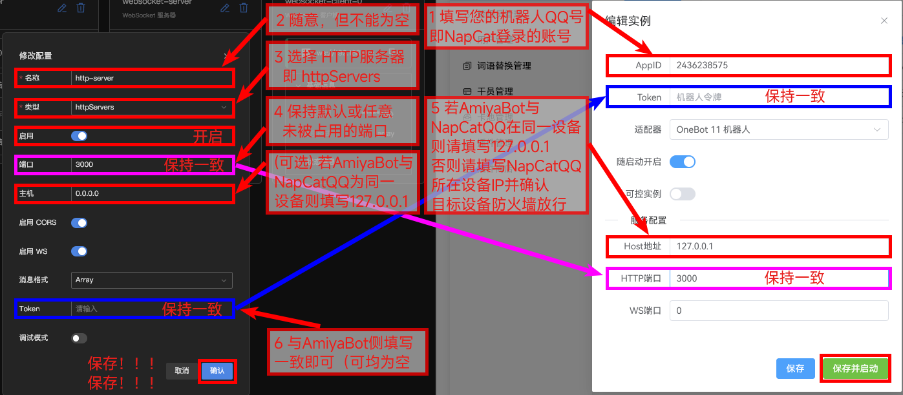
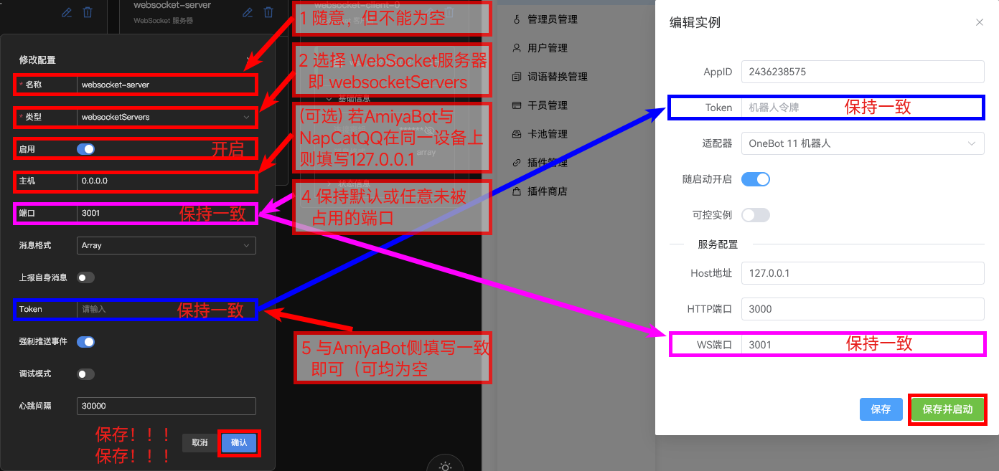

# NapCatQQ QQ群机器人

## 初略流程

1. 遵照其详细教程启动 NapCat 本体。
2. 进入 WebUI，启动需要的 HTTP/WS 服务端。
3. 配置 AmiyaBot 连接 NapCat。

## 启动方式

NapCat 有着众多启动方式，每种方式各有优点：

- **Shell 版本**：具有低内存、服务器部署简单的特点。
- **Framework 版本**：具有方便人机交互、便于窥屏的特点。

## 安装

略，详见 [NapCatQQ 官方文档](https://napneko.github.io/guide/install)。

## 配置

### 通过 WebUI 配置

默认地址为 `0.0.0.0`，即监听所有地址。当配置了不可用的地址时将禁用 WebUI。

默认端口为 `6099`，当端口被设置为 `0` 时将禁用 WebUI。

启动后可在启动日志中看到形如 `[WebUi] WebUi Local Panel Url: http://127.0.0.1:6099/webui?token=xxxx` 的token信息。

也可打开 `webui.json` 文件，在其中找到token。

```webui.json
{
    "host": "0.0.0.0", // WebUI 监听地址
    "port": 6099, // WebUI 端口
    "token": "xxxx", //登录密钥，默认是自动生成的随机登录密码
    "loginRate": 3, //每分钟登录次数限制
}
```

访问 `http://ip:port/webui/`，然后进行以下操作：
1. 进入 QQ 登录，点击 `QRCode` 进行二维码登录。
2. 登录成功后，进入网络配置添加以下配置。
   1. HTTP 配置如下图（看不清楚可以右键图片在新标签中打开）
      
   2. websocket 配置如下图（看不清楚可以右键图片在新标签中打开）
      
3. 配置完成后，点击确认即可。
